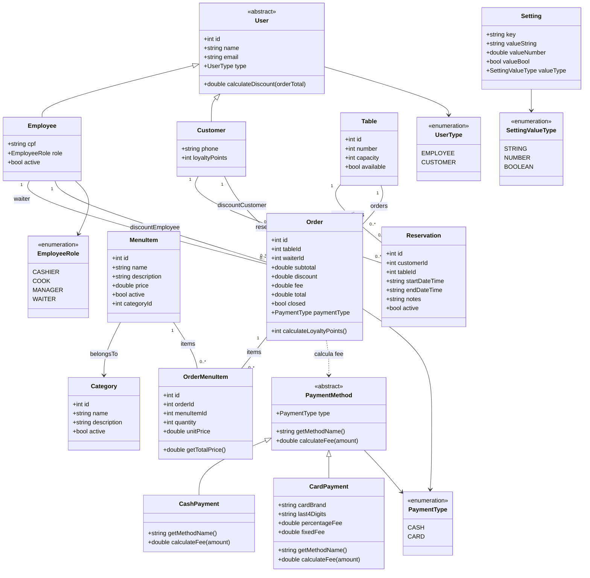

```mermaid
classDiagram
%% ========= CLASSES DE USUÁRIO =========
class User {
<<abstract>>
+int id
+string name
+string email
+UserType type
+double calculateDiscount(orderTotal)
}

    class Employee {
        +string cpf
        +EmployeeRole role
        +bool active
    }

    class Customer {
        +string phone
        +int loyaltyPoints
    }

    User <|-- Employee
    User <|-- Customer

    %% ========= TABLE & RESERVATION =========
    class Table {
        +int id
        +int number
        +int capacity
        +bool available
    }

    class Reservation {
        +int id
        +int customerId
        +int tableId
        +string startDateTime
        +string endDateTime
        +string notes
        +bool active
    }

    Customer "1" -- "0..*" Reservation : reservations
    Table "1" -- "0..*" Reservation : reservations

    %% ========= MENU & ORDER =========
    class MenuItem {
        +int id
        +string name
        +string description
        +double price
        +bool active
        +int categoryId
    }

    class Category {
        +int id
        +string name
        +string description
        +bool active
    }

    MenuItem --> Category : belongsTo

    class Order {
        +int id
        +int tableId
        +int waiterId
        +double subtotal
        +double discount
        +double fee
        +double total
        +bool closed
        +PaymentType paymentType
        +int calculateLoyaltyPoints()
        %% associações de desconto (XOR):
        %% +optional<int> customerId
        %% +optional<int> employeeId
    }

    class OrderMenuItem {
        +int id
        +int orderId
        +int menuItemId
        +int quantity
        +double unitPrice
        +double getTotalPrice()
    }

    %% Order / Table / Waiter
    Table "1" -- "0..*" Order : orders
    Employee "1" -- "0..*" Order : waiter

    %% Desconto associado a UM tipo de usuário (Customer OU Employee)
    Customer "1" -- "0..*" Order : discountCustomer
    Employee "1" -- "0..*" Order : discountEmployee

    %% N:N via OrderMenuItem
    Order "1" -- "0..*" OrderMenuItem : items
    MenuItem "1" -- "0..*" OrderMenuItem : items

    %% ========= PAYMENT =========
    class PaymentMethod {
        <<abstract>>
        +PaymentType type
        +string getMethodName()
        +double calculateFee(amount)
    }

    class CashPayment {
        +string getMethodName()
        +double calculateFee(amount)
    }

    class CardPayment {
        +string cardBrand
        +string last4Digits
        +double percentageFee
        +double fixedFee
        +string getMethodName()
        +double calculateFee(amount)
    }

    PaymentMethod <|-- CashPayment
    PaymentMethod <|-- CardPayment

    Order ..> PaymentMethod : calcula fee

    %% ========= SETTINGS =========
    class Setting {
        +string key
        +string valueString
        +double valueNumber
        +bool valueBool
        +SettingValueType valueType
    }

    class SettingValueType {
        <<enumeration>>
        STRING
        NUMBER
        BOOLEAN
    }

    Setting --> SettingValueType

    %% ========= ENUMS =========
    class EmployeeRole {
        <<enumeration>>
        CASHIER
        COOK
        MANAGER
        WAITER
    }

    class PaymentType {
        <<enumeration>>
        CASH
        CARD
    }

    class UserType {
        <<enumeration>>
        EMPLOYEE
        CUSTOMER
    }

    User --> UserType
    Employee --> EmployeeRole
    Order --> PaymentType
    PaymentMethod --> PaymentType
```
